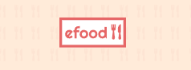
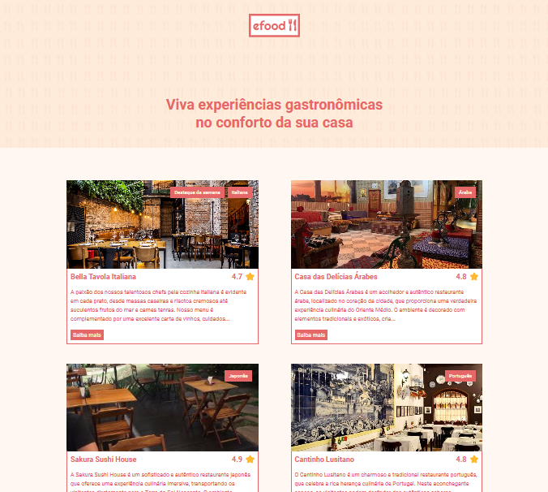
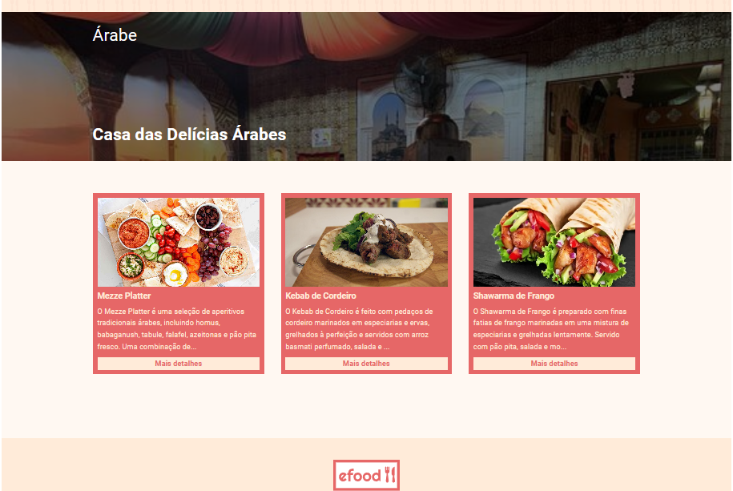
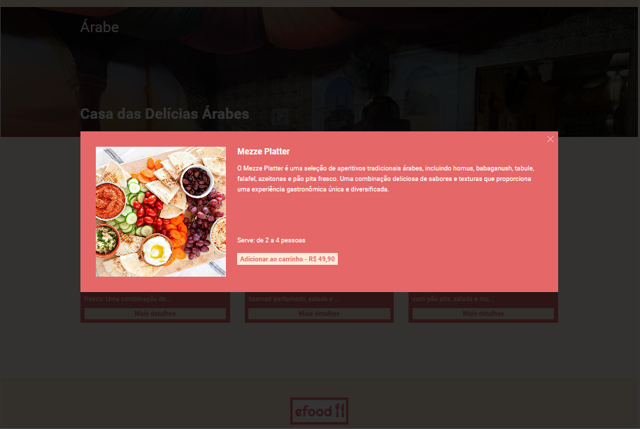
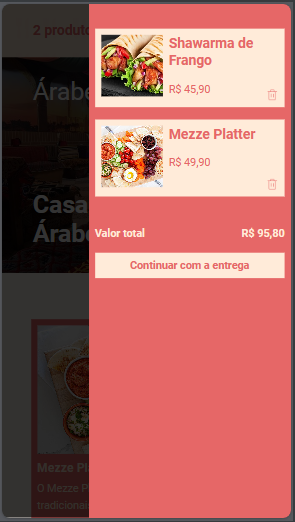
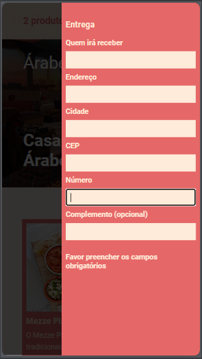
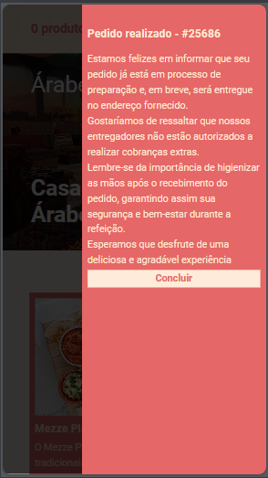

<hr>

### Tópicos

- [Descrição do projeto](#descrição-do-projeto)

- [Funcionalidades](#funcionalidades)

- [Layout](#layout)

- [Ferramentas utilizadas](#ferramentas-utilizadas)

- [Figma do Projeto](#figma-do-projeto)

- [Acesso ao projeto](#acesso-ao-projeto)

- [Abrir e rodar o projeto](#abrir-e-rodar-o-projeto)

- [Desenvolvedor](#desenvolvedor)

## Descrição do projeto

<p align="justify">
Este projeto foi desenvolvido como tarefa final do meu curso de Desenvolvimento Front-End da EBAC, onde me foi passado através do Figma, os requisitos pedidos para entrega. O projeto é submetido a avaliação de um tutor, que analisa sua conformidade com as dimensões e layout do figma, assim como todas as suas funcionalidades. 

O projeto traz a ideia de um site e-commerce. Sua página home recebe os dados dos restaurantes através do consumo de uma API. Ao clicar em saiba mais no card do estabelecimento escolhido, é direcionado a uma página contendo o cardápio do restaurante, que também é trazido por uma API. Ao selecionar o produto de sua preferência, é direcionado a um modal com mais informações, trazendo a opção de adicionar ao carrinho. Ao adicionar traz todas as operações de um carrinho, continuando para a entrega. Fazendo o preenchimento da entrega corretamente, é direcionado a continuar com o pagamento, onde tem um outro formulário para dados do cartão. Sendo validado, finaliza o pagamento, exibindo uma tela de confirmação, com o número do pedido que é gerado dinamicamente.
  



</p>

## Funcionalidades

:heavy_check_mark: `Funcionalidade 1:` Site e-commerce exibindo diversos restaurantes.

:heavy_check_mark: `Funcionalidade 2:` Ao selecionar um estabelecimento, é guiado a uma página que traz informações sobre as opções de cardápio.

:heavy_check_mark: `Funcionalidade 3:` Clicando no card de um produto, é aberto uma modal trazendo mais informações e um botão que adiciona ao carrinho.

:heavy_check_mark: `Funcionalidade 4:` O carrinho tem todas as funcionalidades padrões, levando a um formulário para entrega do produto, que continua pelo pagamento até a confirmação do pedido

## Layout 

<div align="center">





### Layout Responsivo

      

  </div>

###

## Ferramentas utilizadas

        

- React
- Redux
- TypeScript
- JavaScript
- HTML
- Git
- Styled-Components

🎈 <i><b>OBS:</b></i> 

Foi feito o uso do Redux para fazer o gerenciamento de estado da aplicação, evitando passar as propriedades por muitos componentes.

O uso do Styled-Components resolve alguns problemas, como a repetição de códigos, visto que nos permite criar componentes reutilizáveis e compartilháveis, tornando manutenções e futuras mudanças mais simples.

Fazendo a validação do formulário com useFormik e validationSchema e usando o InputMask para criar uma máscara nos campos de input.

###

## Figma do Projeto

<a href="https://www.figma.com/file/JjduV2Tg713TzYUUsees8b/efood?type=design&node-id=1-7&mode=design&t=YGDcQEMCutGSxtt1-0" target="_blank"></a>

## Acesso ao projeto

Você pode <a href="https://efood-bruno-dias.vercel.app/" target="_blank">acessar o site do projeto.</a>

## Abrir e rodar o projeto

```cmd
# Clone este repositório
git clone <link do repositório>

# Acesse a pasta do projeto no seu terminal
cd <nome do projeto>

# Instalar dependências
npm install

# Execute a aplicação
npm start

```

## Desenvolvedor

[<br><sub>Bruno Dias de Freitas</sub>](https://www.linkedin.com/in/brunodias-dev)
